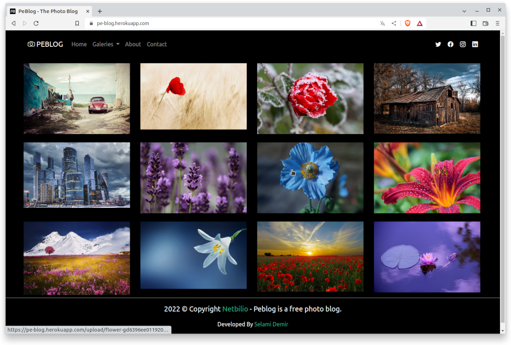
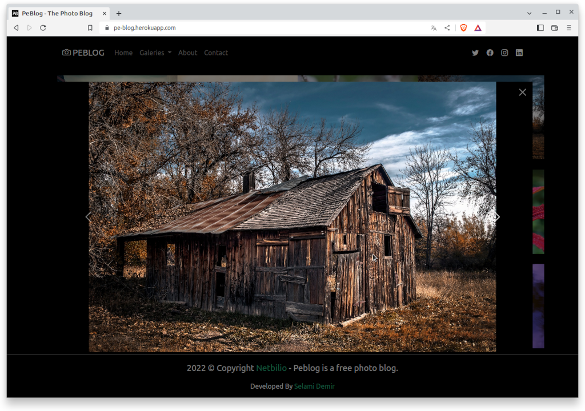
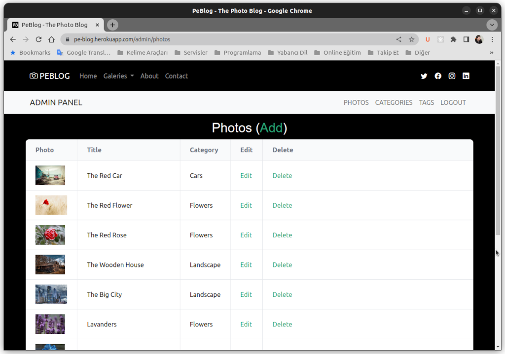
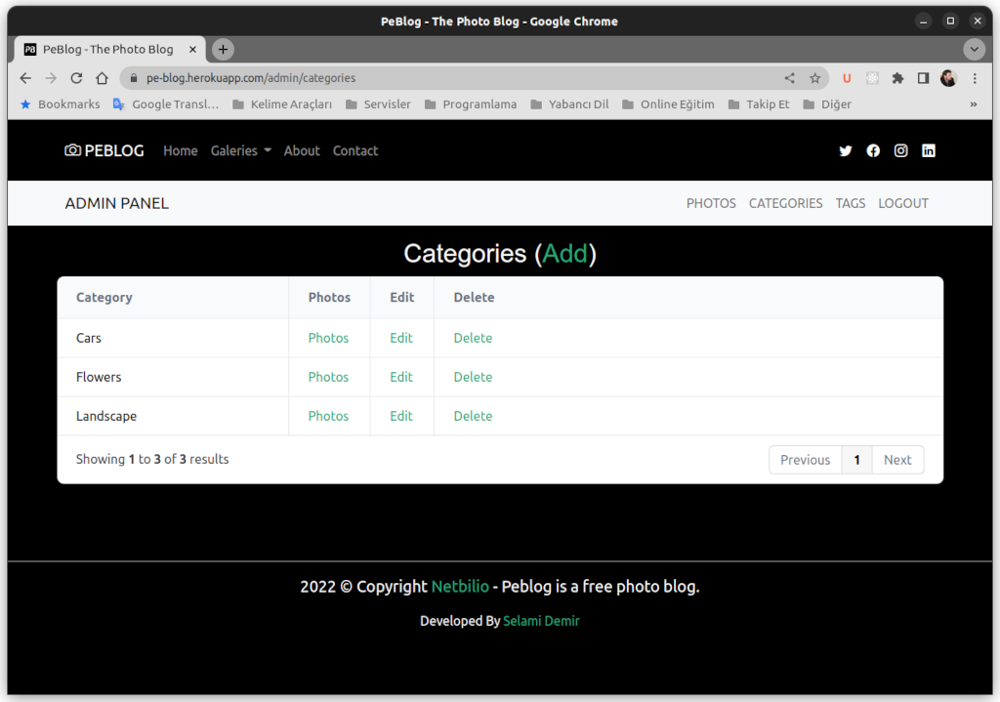

# PeBlog - Fotoğraf Blog Uygulaması

PeBlog fotoğraf paylaşımında bulunmak isteyenler için geliştirilmiş bir fotoğraf blog uygulamasıdır. Şuan için sadece bir kişinin fotoğraf paylaşmasına izin verir. Kategori ve etiket desteği vardır. Fotoğraf, kategori, etiket ekleyip, silinebilir veya düzenlenebilir.

## Kullanılan Teknolojiler

PeBlog geliştirilirken

- Express JS,
- EJS template.
- Mongoose.
- Mongodb.
- Bcrypt.
- Dotenv.
- GridJs.
- Express Filupload.
- Express Session.
- Express Validator.
- Method Overrite.
- Slugify.

Uygulama ve paketleri kullanılmıştır.

## Uygulamayı Kurmak

Repoyu bilgisayarınıza indirebilir veya forklayarak kullanabilirsiniz. Test etmek için dosyaları proje klasörünüze indirdikten sonra komut satırını açın ve terminalden proje klasörüne gelin sonrasında **npm init** komutunu vererek gerekli node modüllerinin kurulmasını sağlayın. Sonrasında

```
APP_MONGODB_FULL_URL=
APP_SECTION_SECRET=
```

**.env** dosyası üzerinde bulunan yukarıdaki bilgileri doğru olarak giriniz. Burada **APP_SECTION_SECRET** güvenlik kelimesidir ve karışık harf ve rakamlardan oluştuan en az 16 rakamlı bir metin dizesidir. 

Mongodb bağlantısı için ise **APP_MONGODB_FULL_URL** bilgisini tam olarak girmeniz gerekiyor.

Gerekli bilgileri girdikten sonra komut satırından ( proje dizinine geldikten sonra) ```node app``` komutunu vererek uygulamayı başlatabilirsiniz.

## Üye Kayıtı

Şuan için sadece tek bir üye kayıtı seçeneği mevcut. Bunun için **http://localhost:5000/login** adresine giriş yapmanız yeterli olacaktır. Veritabanından kayıtlı üye yoksa, kayıt formunu ve eğer kayıtlı üye varsa üye giriş ekranı görüntülenecektir. Eğer üye girişi yapılmış ise anasayfaya yönlendirme yapılacaktır.

## Ekran Görüntüleri


Anasayfa


Lightbox


Admin Photo Page


Admin Kategori Sayfası

A personel photo blog. It was created with Express JS. MongoDB is for the database.